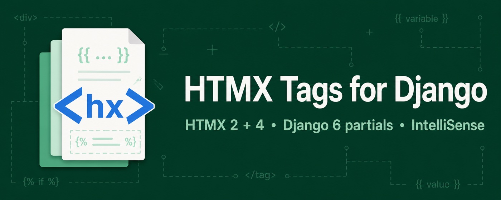
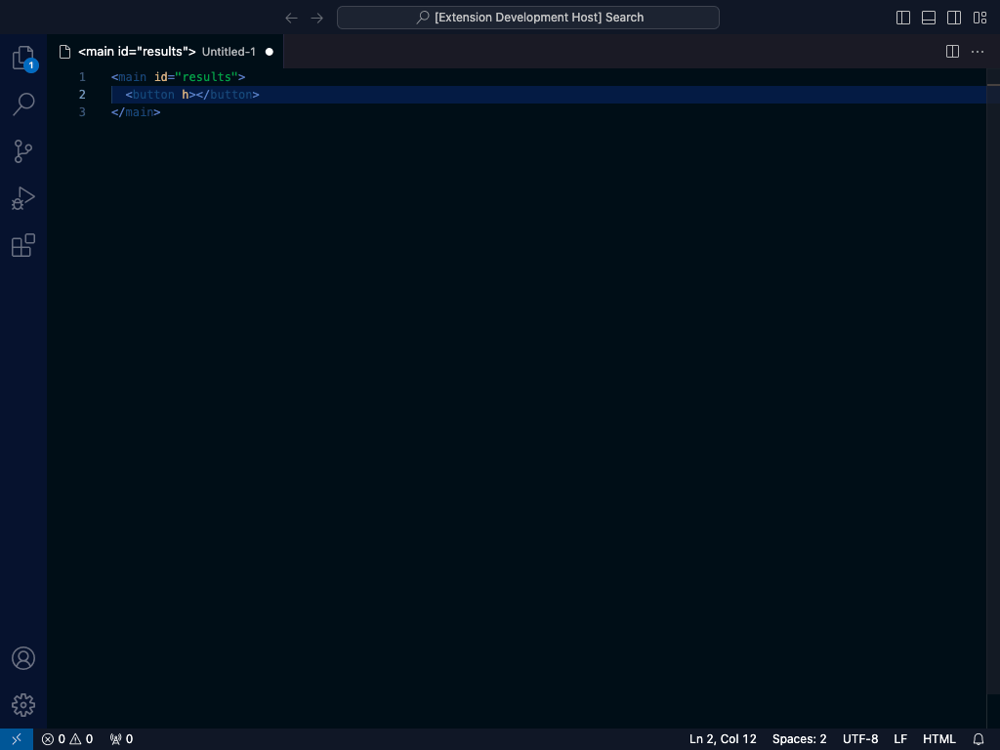
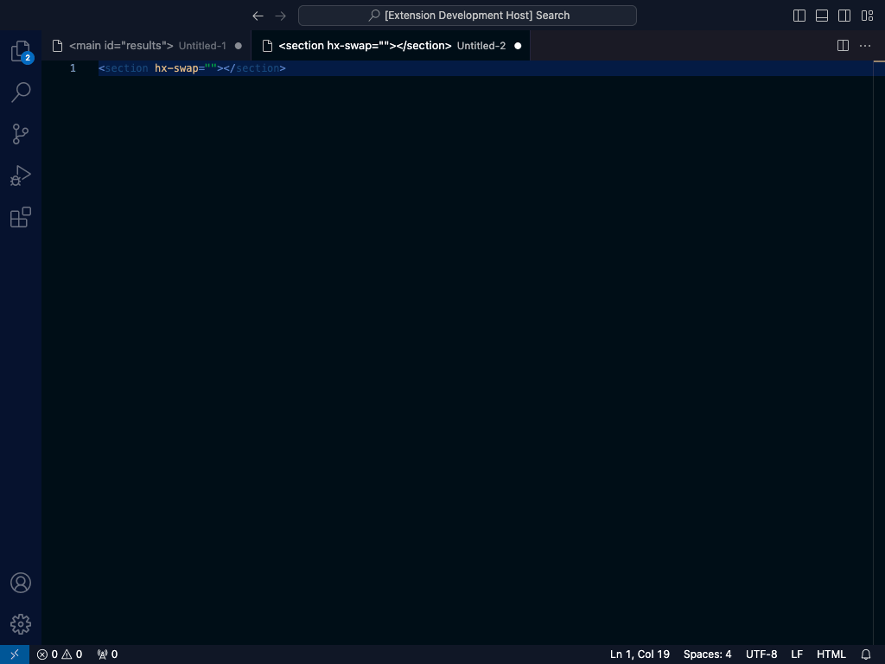
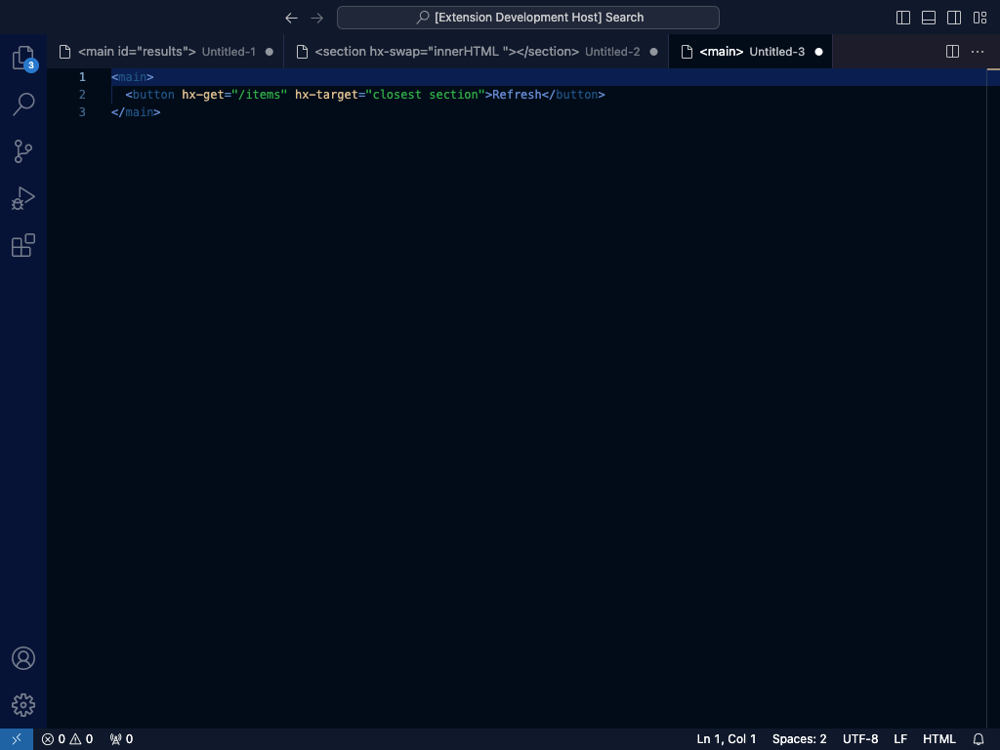
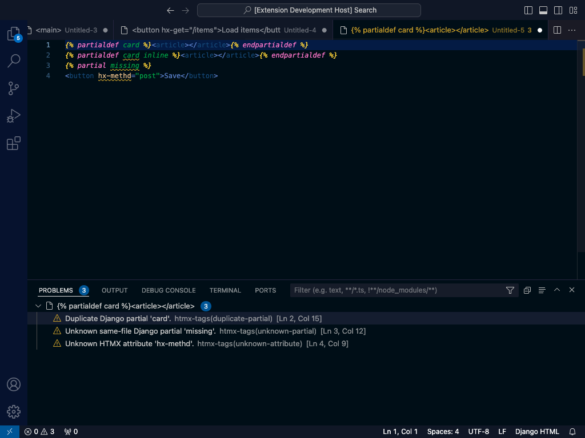
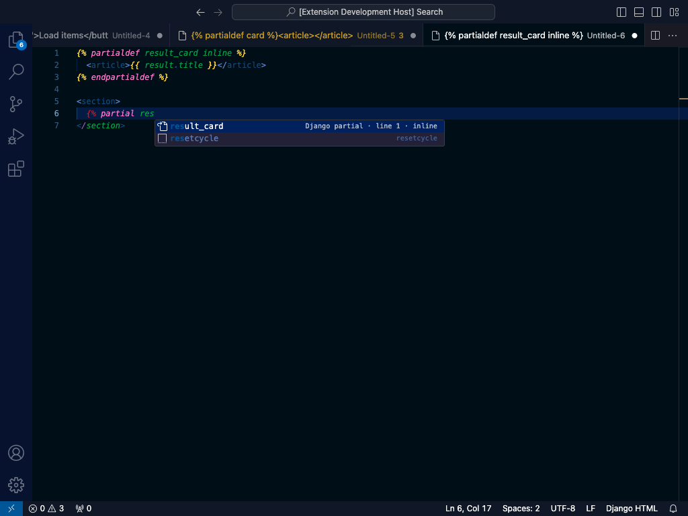

# HTMX Django IntelliSense

Write HTMX faster in VS Code. HTMX Django IntelliSense adds completions, value suggestions, hover docs,
diagnostics, and Django 6 partial support to HTML, Django templates, and Python views—entirely offline.

[Install from the Visual Studio Marketplace](https://marketplace.visualstudio.com/items?itemName=difegam.htmx-django-intellisense)

<p align="center">
  <a href="https://marketplace.visualstudio.com/items?itemName=difegam.htmx-django-intellisense">
    
  </a>
  <a href="https://marketplace.visualstudio.com/items?itemName=difegam.htmx-django-intellisense">
    
  </a>
  <a href="https://github.com/difegam/htmx-django-intellisense/blob/main/LICENSE.txt">
    
  </a>
  
  <br>
  <a href="https://marketplace.visualstudio.com/items?itemName=difegam.htmx-django-intellisense">
    
  </a>
  <a href="https://open-vsx.org/extension/difegam/htmx-django-intellisense">
    
  </a>
</p>

## Install and use

1. Open **Extensions** in VS Code (`Ctrl/Cmd+Shift+X`).
1. Search for **HTMX Django IntelliSense** and install it.
1. Open an `html` or `django-html` template and start typing `hx-`.

Django template support uses the [Django extension](https://marketplace.visualstudio.com/items?itemName=batisteo.vscode-django), which VS Code installs as an extension dependency.

## What you get

- Complete `hx-*` attributes and documented values for swaps, targets, triggers, encodings, and methods.
- Use the same help with `data-hx-*` aliases, `hx-on:*`, response targets, and HTMX 4 modifiers.
- Hover for concise documentation, version availability, and official HTMX links.
- Catch clear HTMX typos and invalid documented values without warning on ordinary HTML or Django expressions.
- Apply one-click quick fixes for HTMX typos, deprecated attributes, invalid documented values, and unknown partials.
- Complete and navigate Django 6 partial tags locally or through static `template.html#partial` references.
- Rename a Django partial or find all of its references across the current template.
- Insert Django-ready GET, CSRF-safe POST, delete, search, infinite scroll, and partial snippets.

## Editor experience

### Attribute Completions

> **Find the right HTMX attribute without leaving your template.** Type `hx-` in HTML or Django HTML to see version-aware attributes, aliases, dynamic syntax, and Django-ready snippets.



### Context-Aware Value Completions

> **Get values that match the attribute you are editing.** `hx-swap`, `hx-trigger`, and `hx-target` suggest documented strategies, events, and modifier fragments exactly where you need them.



### Hover Documentation

> **Understand an attribute at a glance.** Hover a recognized `hx-*` or `data-hx-*` attribute for its purpose, supported HTMX versions, suggested values, and official documentation links.



### Diagnostics and Django partials

| Compatible diagnostics                                 | Django partial completion                         |
| ------------------------------------------------------ | ------------------------------------------------- |
|  |  |

Every diagnostic ships a quick fix (the `Ctrl/Cmd+.` lightbulb): a misspelled `hx-` attribute suggests its nearest catalog name, a deprecated attribute offers its documented successor, an invalid documented value offers the allowed values, and an unknown partial offers a matching name or a `` stub.

## Built for Django templates

[Template partials](https://docs.djangoproject.com/en/6.0/ref/templates/language/#template-partials) ship natively in Django 6.0. This extension understands their ``/`` tags out of the box.

Definitions in the current template are offered after `{% partial `:

```django

  <article id="result-{{ result.pk }}">{{ result.title }}</article>



```

Go to Definition and Peek Definition jump from `` to its local definition. Find All References lists every use of a partial in the file, and Rename Symbol (`F2`) updates a partial's definition and all of its references together. Static cross-template references also complete and navigate from Django includes and common Python APIs:

```django

```

```python
return render(request, "results.html#result_card", context)
```

Cross-template lookup scans matching workspace files on demand. When multiple apps contain the same template path, VS Code shows every matching definition rather than guessing Django's runtime loader order.

## HTMX version support

The committed catalog covers HTMX `2.0.10` and `4.0.0-beta6`. `compatible` mode is the default: it accepts their union without version warnings. Choose `2` or `4` when you want cross-version syntax surfaced as hints.

## Settings

| Setting                       | Default      | Purpose                                         |
| ----------------------------- | ------------ | ----------------------------------------------- |
| `htmxDjango.enableCompletion` | `true`       | Enable HTMX and Django partial completions.     |
| `htmxDjango.enableHover`      | `true`       | Enable attribute and partial hover information. |
| `htmxDjango.enableValidation` | `true`       | Enable HTMX and same-file partial diagnostics.  |
| `htmxDjango.version`          | `compatible` | Use `compatible`, `2`, or `4`.                  |

## Django snippets

Type a snippet prefix in a `django-html` document to insert a secure Django-ready HTMX pattern.
See the [snippet and example catalog](docs/reference/snippets.md) for every prefix and its generated output.

## Offline by design

The extension packages its generated HTMX catalog and never requests documentation or metadata at runtime.

## Contributing

Install both toolchains first — the Node extension and the Python catalog/snippet
generator (`tools/`, managed with `uv`). `npm test` runs Python tests too, so the `uv`
environment must exist before you run it:

```bash
npm install
uv sync --project tools --frozen --all-groups
```

Then run the checks and package the extension:

```bash
npm test
npm run test:extension
npm run package
```

Run the Python generator tests directly with:

```bash
uv run --project tools pytest -c tools/pyproject.toml tools/tests
```

Regenerate the committed offline catalog from the pinned HTMX `2.0.10` and `4.0.0-beta6` tags:

```bash
npm run build-data
```

Add or update a snippet once in `snippets/django-htmx.source.json`, then regenerate its runtime
definition and documentation together:

```bash
npm run build-snippets
```

## Documentation

Read the [full documentation](https://difegam.github.io/htmx-django-intellisense/) for setup, HTMX authoring, partials, configuration, packaging, and release guidance. The source lives under [`docs/`](docs/index.md).

## Project history

This project started from [otovo/htmx-tags](https://github.com/otovo/htmx-tags), which offered plain HTMX tag completion for HTML files. It has since diverged into an independent, Django-focused toolchain: a dual-version (HTMX 2/4) offline catalog with diagnostics and quick fixes, and IntelliSense for Django 6.0's built-in [``/`` template partials](https://docs.djangoproject.com/en/6.0/ref/templates/language/#template-partials) — a feature that originated from [django-template-partials](https://github.com/carltongibson/django-template-partials) by Carlton Gibson before landing in Django core — none of which exists in the original project or in other generic HTMX completion extensions.

## License

Licensed under Apache 2.0. Maintained independently at [difegam/htmx-django-intellisense](https://github.com/difegam/htmx-django-intellisense).
