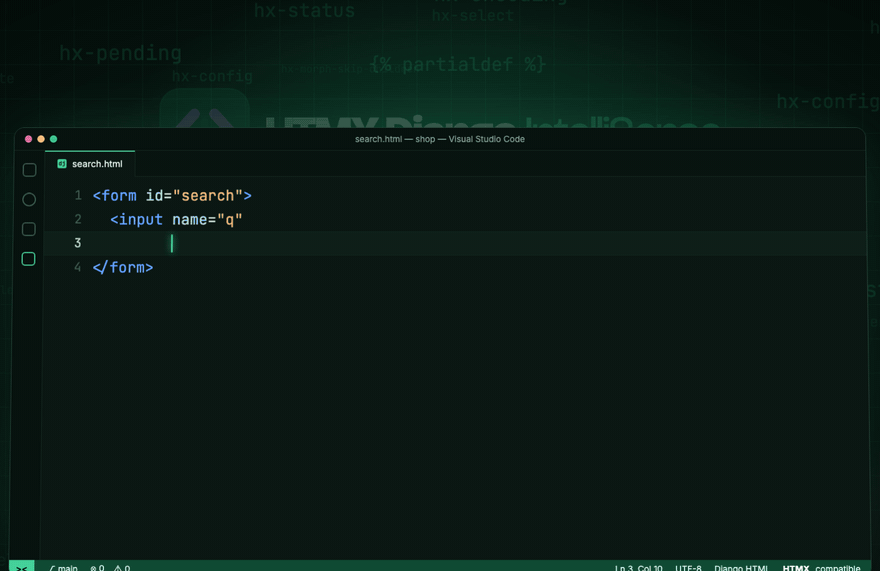
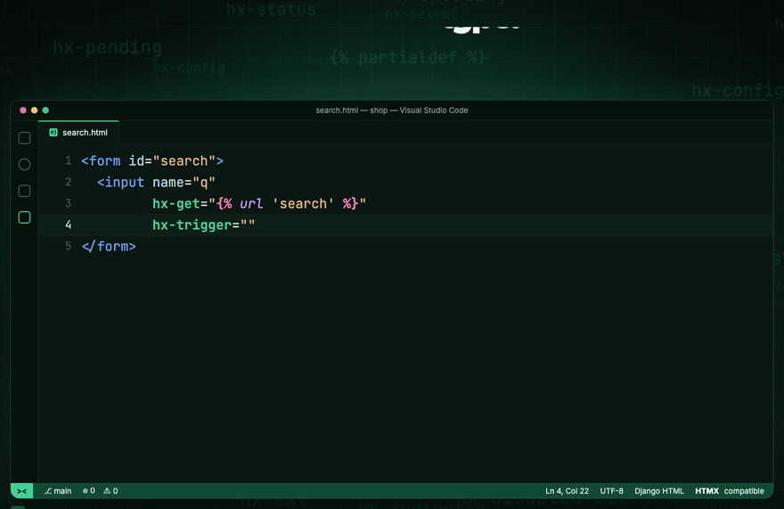
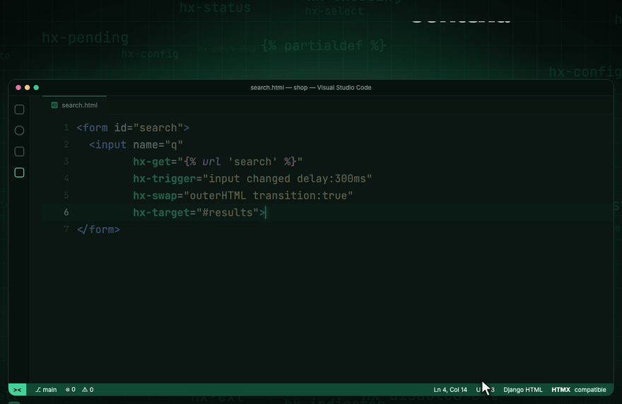
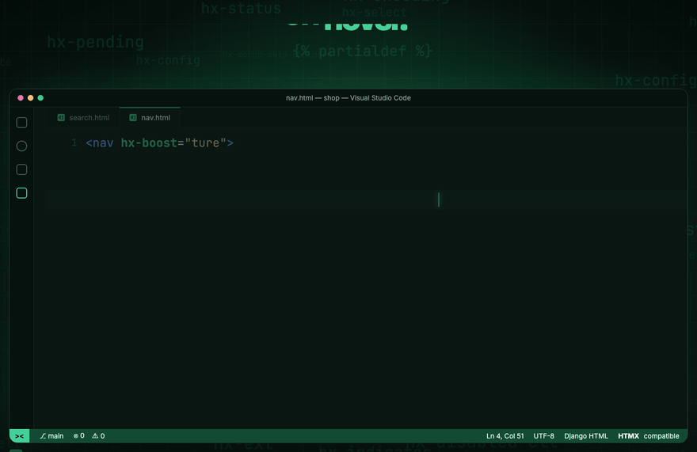
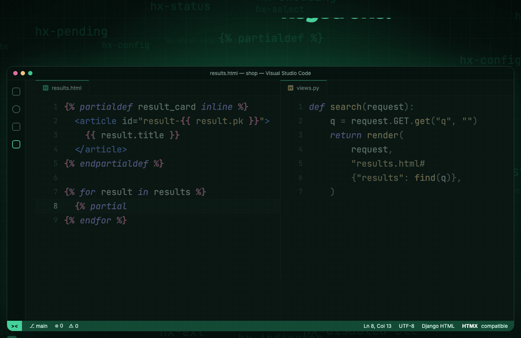
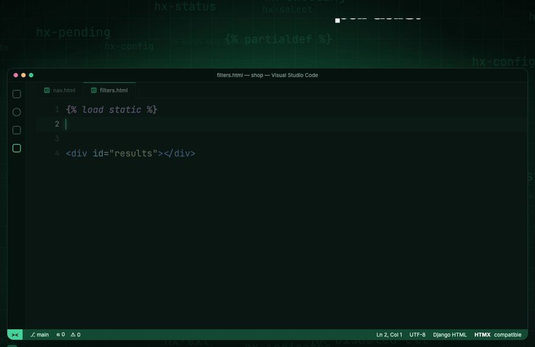

<p align="center">
  <picture>
    <source media="(prefers-color-scheme: dark)" srcset="docs/assets/logo-dark.svg">
    
  </picture>
</p>

<h3 align="center">Offline HTMX IntelliSense for Django templates.</h3>

<p align="center">
  Completions, hover documentation, diagnostics, quick fixes, and snippets for
  HTMX 2 and 4 in VS Code, plus completion, navigation, and rename for Django 6
  template partials. Everything runs from a committed catalog with no network
  requests.
</p>

<p align="center">
  <a href="https://marketplace.visualstudio.com/items?itemName=difegam3.htmx-django-intellisense"></a>
  <a href="https://open-vsx.org/extension/difegam3/htmx-django-intellisense"></a>
  
  
  
  <a href="https://difegam.github.io/htmx-django-intellisense/"></a>
  <a href="https://github.com/difegam/htmx-django-intellisense/actions/workflows/verify.yml"></a>
  <a href="https://deepwiki.com/difegam/htmx-django-intellisense"></a>
  <a href="https://github.com/difegam/htmx-django-intellisense/blob/main/LICENSE.txt"></a>
</p>

<p align="center">
  <a href="https://difegam.github.io/htmx-django-intellisense/"><strong>Documentation</strong></a> ·
  <a href="#installation">Installation</a> ·
  <a href="#why-htmx-django-intellisense">Why</a> ·
  <a href="#features">Features</a> ·
  <a href="#compatibility-and-settings">Settings</a> ·
  <a href="#development">Development</a>
</p>

<p align="center">
  
</p>

## Installation

Install **HTMX Django IntelliSense** from the
[Visual Studio Marketplace](https://marketplace.visualstudio.com/items?itemName=difegam3.htmx-django-intellisense)
or [Open VSX](https://open-vsx.org/extension/difegam3/htmx-django-intellisense),
or from the Quick Open palette (`Ctrl/Cmd+P`):

```text
ext install difegam3.htmx-django-intellisense
```

Alternatively, install a local VSIX from a checkout:

```bash
npm install
npm run package
code --install-extension htmx-django-intellisense-*.vsix --force
```

If you use [VS Code profiles](https://code.visualstudio.com/docs/editor/profiles), this installs into the
default profile's extension pool. If the extension doesn't show up in the Extensions view, check which
profile your workspace uses and reinstall with `--profile "<your-profile-name>"`.

Django template support requires the
[Django extension](https://marketplace.visualstudio.com/items?itemName=batisteo.vscode-django),
which VS Code installs as an extension dependency. Open an `html` or
`django-html` template and type `hx-` to verify activation.

Read the [full documentation](https://difegam.github.io/htmx-django-intellisense/)
for guides on authoring HTMX, Django partials, configuration, testing,
packaging, and releases.

## Why HTMX Django IntelliSense

- **Both HTMX majors.** One catalog covers HTMX `2.0.11` and `4.0.0`. Version-specific
    attributes, values, and modifiers are labelled, and a single setting narrows
    suggestions to one major.
- **Context, not a word list.** `hx-swap`, `hx-trigger`, and `hx-target` suggest
    the strategies, events, and modifiers that fit where the cursor is.
- **Mistakes caught as you type.** Misspelled attributes, invalid documented
    values, deprecated attributes, and unknown partials are flagged with a quick fix.
- **Django 6 partials are first-class.** `` and ``
    complete, navigate, rename, and resolve across `template.html#partial`
    references in templates and Python.
- **Django-ready snippets.** CSRF-safe POST, delete, search, infinite scroll,
    modals, out-of-band swaps, and partial responses.
- **Offline.** The extension reads its committed catalog and makes no runtime
    network requests.

## Features

### Attribute completion

Type `hx-` in HTML or Django HTML to see every HTMX attribute with its
description and version availability. HTMX 4-only attributes are badged, and
aliases, `data-hx-*`, and dynamic syntax such as `hx-on:<event>` complete too.

<p align="center">
  
</p>

### Context-aware values

Values are suggested for the attribute being edited. `hx-trigger` offers
events and then modifiers such as `changed` and `delay:`, and `hx-swap` offers
strategies, with HTMX 4 strategies such as `innerMorph` labelled, followed by
modifiers such as `transition:`.

<p align="center">
  
</p>

### Hover documentation

Hover a recognized `hx-*` or `data-hx-*` attribute for its purpose, supported
HTMX versions, categories, values and modifiers, an example, and links to the
official HTMX 2 and HTMX 4 documentation.

<p align="center">
  
</p>

### Diagnostics and quick fixes

The extension reports misspelled HTMX attributes, deprecated attributes,
invalid documented values, and unknown or duplicate Django partials. Each
diagnostic offers a fix from the `Ctrl/Cmd+.` lightbulb.

<!-- cspell:ignore ture tirgger -->

<p align="center">
  
</p>

### Django template partials

Definitions in the current template are offered after `{% partial `:

```django

  <article id="result-{{ result.pk }}">{{ result.title }}</article>



```

Go to Definition, Peek Definition, Find All References, and Rename Symbol work
with local partials. Static cross-template references also complete and
navigate from Django includes and common Python APIs:

```django

```

```python
return render(request, "results.html#result_card", context)
```

<p align="center">
  
</p>

See the [Django partials guide](docs/how-to/django-partials.md) for lookup
rules, diagnostics, and cross-template behavior.

### Django snippets

Type a snippet prefix in a `django-html` document to insert a secure,
Django-ready HTMX pattern, then `Tab` through its placeholders. See the
[snippet and example catalog](docs/reference/snippets.md) for every prefix and
its generated output.

<p align="center">
  
</p>

## Compatibility and settings

| Requirement | Supported                                                  |
| ----------- | ---------------------------------------------------------- |
| VS Code     | 1.90 or later                                              |
| HTMX        | 2.0.11 and 4.0.0                                           |
| Django      | Templates via `batisteo.vscode-django`; partials need 6.0+ |

`compatible` mode is the default and accepts the union of both HTMX versions.
Choose `2` or `4` to surface cross-version syntax as hints.

| Setting                       | Default      | Purpose                                        |
| ----------------------------- | ------------ | ---------------------------------------------- |
| `htmxDjango.enableCompletion` | `true`       | Enable HTMX and Django partial completions.    |
| `htmxDjango.enableHover`      | `true`       | Enable HTMX and partial hover information.     |
| `htmxDjango.enableValidation` | `true`       | Enable HTMX and same-file partial diagnostics. |
| `htmxDjango.version`          | `compatible` | Use `compatible`, `2`, or `4`.                 |

See the [configuration guide](docs/how-to/configuration.md) and
[settings reference](docs/reference/settings.md) for details.

## Development

This repository contains the TypeScript VS Code extension and a Python
toolchain under `tools/` that generates the offline HTMX catalog and snippets.
Install [uv](https://docs.astral.sh/uv/), npm, and [Just](https://just.systems/),
then run:

```bash
just init
just verify
```

`just init` installs both toolchains and the prek git hooks. `just verify`
runs the complete local CI checklist: linting, type checks, Python and
TypeScript tests, artifact drift checks, extension-host tests, the docs build,
VSIX packaging, and the Python package build.

Useful focused commands:

```bash
npm test
npm run test:extension
npm run package
```

After changing catalog inputs or snippet sources, regenerate the committed
artifacts with `npm run build-data` or `npm run build-snippets`. See the
[first contribution guide](docs/tutorials/first-contribution.md) and
[CI and packaging guide](docs/operations/ci-and-packaging.md) for the full
workflow.

## License

Licensed under Apache 2.0. Maintained independently at
[difegam/htmx-django-intellisense](https://github.com/difegam/htmx-django-intellisense).
