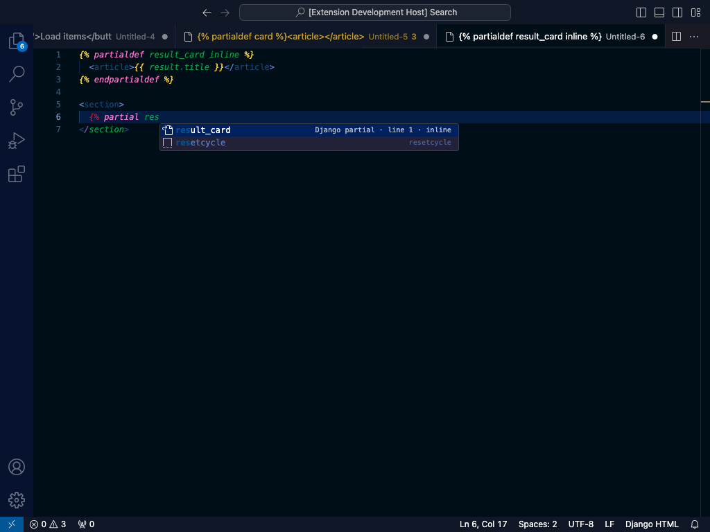

# Django Partials

Define, render, complete, and navigate Django 6 partials in templates and Python views.

[Template partials](https://docs.djangoproject.com/en/6.0/ref/templates/language/#template-partials) are built into Django 6.0. The feature originated from Carlton Gibson's [django-template-partials](https://github.com/carltongibson/django-template-partials) package before landing in Django core.

## Define a partial

```django

  <article>{{ result.title }}</article>

```

Use `inline` when the definition should also render at its definition site:

```django

  <article>{{ result.title }}</article>

```

The `partialdef` and `partialdef-inline` snippets insert these structures.

## Render a local partial

```django

```

After `{% partial`, completion offers names defined in the current file. Hovering a definition or reference identifies its definition line and whether it is inline. Go to Definition and Peek Definition jump from the reference to the matching `partialdef` block.

Typing after `{%` also offers `partialdef`, `partialdef … inline`, `partial`, and `endpartialdef` tag completions.

## Rename and find references

With the cursor on a partial name, Find All References (`Shift+F12`) lists the `partialdef` definition and every use across the workspace: `` tags, `` tags, and the static Python references described below. Rename Symbol (`F2`) rewrites all of them together, with the usual Refactor Preview.

Both work from the `partialdef`, a `` or `include` reference, or the `#name` in a Python string. Unsaved editor contents are used, and files hidden by `files.exclude` or `search.exclude` are skipped.

Rename refuses, with a message, when it cannot be done safely:

- the partial is defined more than once in the same template (use the **Rename duplicate** quick fix first);
- more than one template matching the path defines the partial, so Django's choice is ambiguous;
- the new name is already defined in the template, or is not made of letters, numbers, underscores, and hyphens;
- the workspace holds more template and Python files than the scan limit, so some uses could be missed.

## Reference a partial in another template

Completion after `#` reads definitions from matching workspace templates:

```django

```

The same completion and navigation work for static template arguments to `render`, `render_to_string`, `get_template`, `select_template`, and `TemplateResponse`, including qualified calls and documented keyword arguments, and for `template_name = "…"` class attributes and `as_view(template_name="…")`:

```python
return render(request, "results/cards.html#result_card", context)
```

Hovering the template path (`results/cards.html`) in either place underlines it as a link. `Ctrl/Cmd+click` opens the file, and Go to Definition on the path lists every workspace template that matches. Go to Definition on the `#result_card` part still jumps to the `partialdef`.

## Diagnostics

The extension warns about duplicate `` definitions and references that cannot be resolved in the same file. It ignores partial-looking text in HTML comments, Django comments, `` blocks, and `<script>`/`<style>` bodies. The quick fix for an unresolved reference offers the nearest defined partial name or a `` stub appended to the file, and the quick fix for a duplicate definition renames the later one to an unused `name_2`-style name.

!!! note "Deliberate limit"

    No persistent workspace index or Django settings model is built. Files are matched by exact template-path suffix on demand, so duplicate paths produce multiple navigation targets, and a partial defined in several matching templates cannot be renamed. Duplicates across templates are not reported as diagnostics, because loader order is not modelled. Dynamic template variables, concatenated strings, bytes, and Python f-strings are outside the extension's analysis scope.


